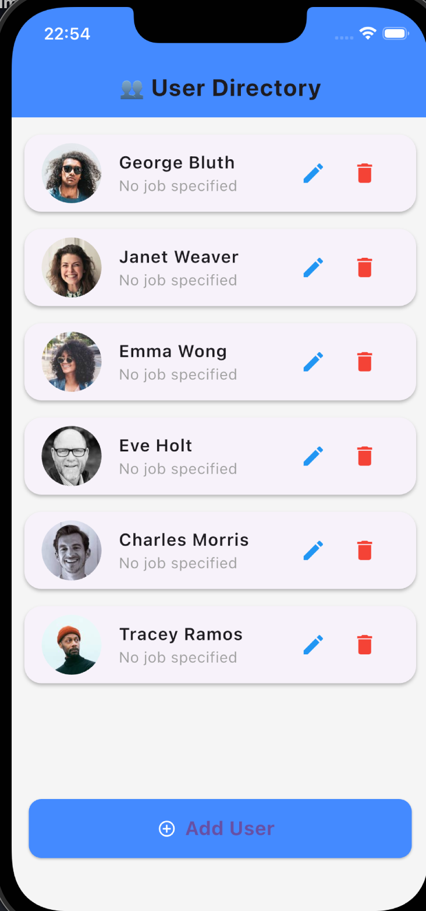
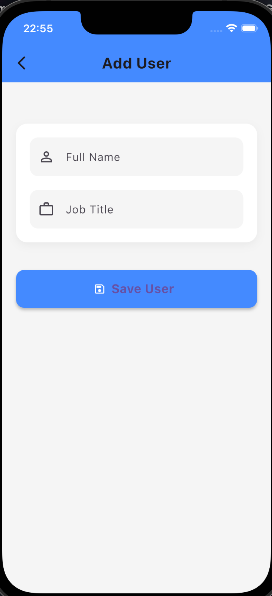
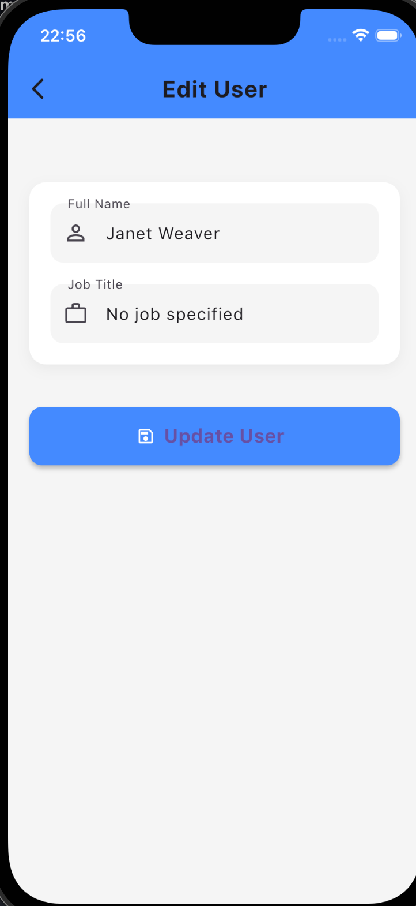

# User Manager App

A Flutter application for managing users with full CRUD (Create, Read, Update, Delete) operations using the ReqRes API.

## 📱 Features

- **View Users**: Display users with profile pictures, names, and emails
- **Add New Users**: Create users with name and job title
- **Edit Users**: Update existing user information
- **Delete Users**: Remove users with confirmation dialog
- **Real-time Updates**: Automatic refresh after operations
- **Modern UI**: Material Design with loading indicators and notifications

## 🔌 API Integration

Uses **ReqRes API** (<https://reqres.in/api>) with authentication:

- `GET /users` - Fetch users list
- `POST /users` - Create new user  
- `PUT /users/{id}` - Update user
- `DELETE /users/{id}` - Delete user

All endpoints require `x-api-key` header for authentication.

### API Endpoints

```http
GET    https://reqres.in/api/users?page=1    # Fetch users list
POST   https://reqres.in/api/users           # Create new user
PUT    https://reqres.in/api/users/{id}      # Update user
DELETE https://reqres.in/api/users/{id}      # Delete user
```

**Required Headers:** `x-api-key: YOUR_API_KEY`

## 🚀 Setup Steps

### Prerequisites

- Flutter SDK (3.0.0+) and Dart SDK (2.17.0+)
- ReqRes API Key

### Installation

1. **Clone and Install**

   ```bash
   git clone https://github.com/yourusername/user_manager_app.git
   cd user_manager_app
   flutter pub get
   ```

2. **Setup Environment**

   Create `.env` file:

   ```env
   MY_API_KEY=your_reqres_api_key_here
   ```

3. **Run App**

   ```bash
   flutter run
   ```

## 📸 Screenshots & App Workflow

| Screen | Preview | Features |
|--------|---------|----------|
| **User List** |  | User avatars, names, emails with edit/delete buttons and FAB |
| **Add User** |  | Clean form with validation for name and job fields |
| **Edit User** |  | Pre-populated form with same validation as add screen |
| **Delete Confirmation** |  | Clear confirmation with user context and action buttons |
| **Success/Error Messages** |   | Color-coded messages that auto-dismiss after few seconds |

## 🔄 App Workflow

1. **App Launch** → Load users → Display in list
2. **Add User** → Tap FAB → Fill form → Save → Refresh list
3. **Edit User** → Tap edit → Modify → Update → Refresh list
4. **Delete User** → Tap delete → Confirm → Delete → Refresh list

## 🛠️ Tech Stack

- **Flutter** - Cross-platform framework
- **ReqRes API** - REST API for user operations
- **Material Design** - UI components
- **HTTP Package** - API communication

## 📋 Features Implemented

✅ **CRUD Operations**: Full Create, Read, Update, Delete functionality  
✅ **API Integration**: ReqRes API with authentication  
✅ **Modern UI**: Material Design with custom styling  
✅ **Form Validation**: Required field validation  
✅ **Error Handling**: Comprehensive error management  
✅ **Loading States**: Visual feedback during operations  
✅ **Confirmation Dialogs**: Safe deletion with confirmation  
✅ **Responsive Design**: Works on mobile, tablet, web, desktop  
✅ **Environment Variables**: Secure API key management  

## 🎯 Future Enhancements

- [ ] Search and filter users
- [ ] Pagination for large user lists
- [ ] Offline support with local storage
- [ ] User profile pictures upload
- [ ] Dark mode theme
- [ ] Unit and integration tests
- [ ] CI/CD pipeline setup


## 🤝 Contributing

1. Fork the project
2. Create your feature branch (`git checkout -b feature/AmazingFeature`)
3. Commit your changes (`git commit -m 'Add some AmazingFeature'`)
4. Push to the branch (`git push origin feature/AmazingFeature`)
5. Open a Pull Request


